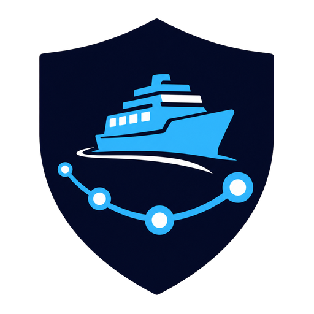

<p align="center">
  
</p>

<h1 align="center">IpamFerry</h1>

<p align="center">Migrações auditáveis de phpIPAM para NetBox.</p>

<p align="center">
  Português · <a href="docs/ARCHITECTURE.en.md">English</a> · <a href="docs/ARQUITECTURA.es.md">Español</a>
</p>

IpamFerry é um painel self-hosted para planejar e executar migrações auditáveis
de phpIPAM para NetBox. Ele aceita conexão pela API phpIPAM ou um dump SQL,
gera um plano revisável, aplica somente pela API oficial do NetBox e exporta um
bundle de auditoria.

> [!WARNING]
> Datasets IPAM e tokens de API são informações sensíveis. Restrinja o painel a
> redes administrativas e use sempre HTTPS.

## Stack

- Laravel 13 e PHP 8.4;
- Inertia 3, React 19, TypeScript e Tailwind CSS 4;
- PostgreSQL e Laravel database queue;
- FrankenPHP/Caddy e Docker Compose;
- AGPL-3.0-only.

## Instalação

Baixe o `compose.yaml` de uma release e execute:

```bash
docker compose up -d --wait
docker compose ps
docker compose exec app php artisan ipamferry:installation-token
```

Abra `https://SEU_SERVIDOR`, use o token para criar o primeiro owner e conclua
o assistente. O Compose gera chaves e senhas internas em volumes Docker; não
há arquivo `.env` operacional.

## Migração

1. Crie um projeto e selecione **API phpIPAM** ou **mysqldump SQL**.
2. Descubra a origem e o destino. Tokens existem apenas na memória da
   requisição e nunca entram no banco, na fila ou no bundle.
3. Use o **Mapping Studio** para revisar objetos, referências, campos, status,
   updates e relações; valide o resultado em um preview não aplicável.
4. Gere um plano específico para aquela origem, destino, versão de API,
   mapeamento e idioma.
5. Resolva todos os conflitos. Um `owner` ou `administrator` aprova o
   fingerprint exato; aprovação não autoriza outro plano.
6. Aplique pela API REST do NetBox. Checkpoints persistentes permitem retomar
   a mesma execução sem duplicar objetos.
7. Verifique por IDs e chaves naturais e baixe o bundle auditável.

O escopo automático cobre o núcleo IPAM e equivalências seguras de Tenancy,
DCIM e Circuits: tenants, tags, sites, locations, racks, manufacturers, device
types, roles, devices, interfaces, MACs, providers, circuit types, circuits,
RIRs, ASNs, VRFs, VLAN Groups, VLANs, Prefixes, IP Addresses e custom fields
aprovados. Primary IP, terminações e NAT estático 1:1 são relações posteriores
que exigem correspondência inequívoca e aprovação.

PAT, sessões BGP, DNS autoritativo, permissões e extensões sem equivalente
seguro são preservados e explicados, nunca convertidos parcialmente ou
descartados silenciosamente.

Atualizações de objetos existentes são desativadas por padrão e habilitadas
por tipo e campo na política. Restrições anunciadas pelo `OPTIONS` do NetBox,
dependências ausentes, identidades ambíguas, colisões de unicidade e dados
obrigatórios incompletos bloqueiam a aprovação.

O parser de dump aceita SQL texto de `mysqldump`; ele nunca inicia MySQL nem
executa sentenças do arquivo. O upload padrão aceita até 1 GiB e usa um
diretório temporário dentro do volume privado, mesmo com o filesystem do
container somente leitura. Para ensaiar, habilite o perfil `sandbox`:

```bash
docker compose --profile sandbox up -d --wait
```

O plano é específico do destino. Portanto, o fluxo correto é:

1. descobrir o NetBox sandbox, gerar, aprovar, aplicar e verificar o plano de
   ensaio;
2. redescobrir somente o NetBox de produção, preservando origem e mapeamento;
3. gerar e aprovar um novo plano irmão, agora calculado contra produção.

Um plano do sandbox nunca é reaproveitado literalmente em produção.
As etapas de aplicação e verificação não permitem trocar o destino: elas usam
obrigatoriamente o sandbox ou a instância de produção registrada no plano.

## Integridade e retomada

- snapshots e planos usam JSON canônico e fingerprints SHA-256;
- cada plano fica vinculado à instância e à versão da API do NetBox;
- links persistentes relacionam a identidade phpIPAM ao ID exato do destino;
- alterações concorrentes no destino são detectadas por `last_updated` e,
  quando disponível no NetBox 4.6+, `ETag`/`If-Match`;
- criação e atualização perdidas após o envio são recuperadas apenas quando o
  estado observado coincide exatamente com o payload aprovado;
- enquanto uma execução não for verificada, descoberta, mapeamento e novo
  planejamento permanecem bloqueados.

## Desenvolvimento

Requer PHP 8.4, Composer e Node 22 ou Docker:

```bash
composer install
npm install
cp .env.example .env
php artisan key:generate
php artisan migrate
npm run build
php artisan test
```

Os comandos de automação são `ipamferry:doctor`, `ipamferry:inspect`,
`ipamferry:plan`, `ipamferry:apply`, `ipamferry:verify` e
`ipamferry:bundle`. A saída do CLI e as chaves dos JSONs reexecutáveis são
sempre em inglês. No container, forneça credenciais efêmeras com

```bash
docker compose exec \
  -e NETBOX_URL=https://netbox.example.test \
  -e NETBOX_TOKEN=... \
  app php artisan ipamferry:apply PROJECT_ID --plan=PLAN_ID
```

Detalhes do modelo, chaves naturais, estados e limites estão em
[docs/ARQUITETURA.md](docs/ARQUITETURA.md). O editor, schemas v2/v3,
compatibilidade e aprovações estão em
[docs/MAPPING-STUDIO.md](docs/MAPPING-STUDIO.md).

## Dados sem equivalente

Itens phpIPAM sem tradução nativa confiável — como permissões, extensões,
registros DNS autoritativos ou dados incompletos de dispositivos — não são
descartados silenciosamente. Eles aparecem no relatório de preservação do
bundle para revisão ou mapeamento manual.
